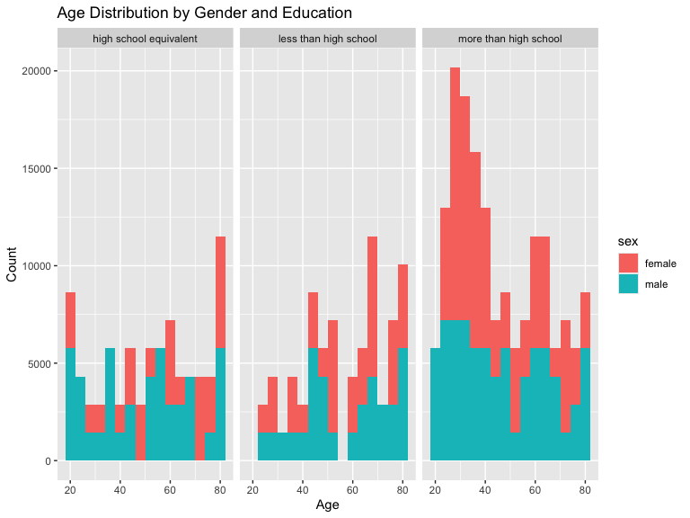
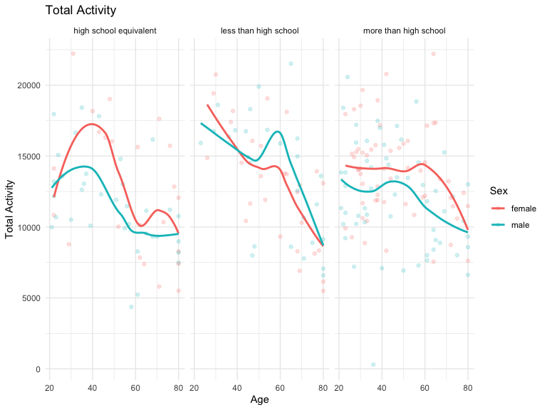
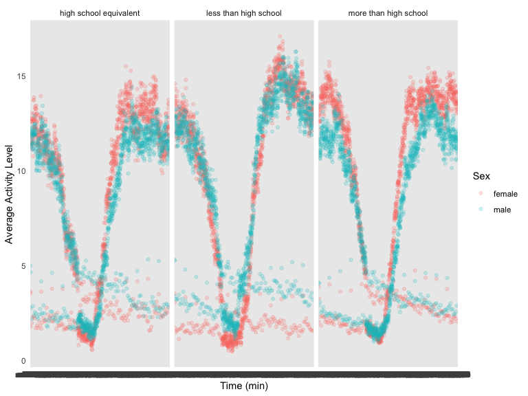
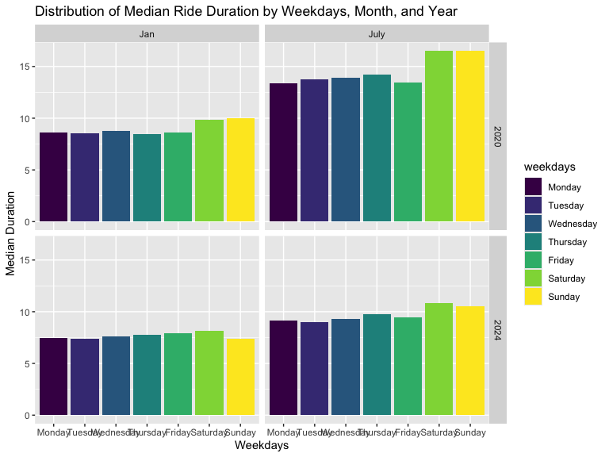
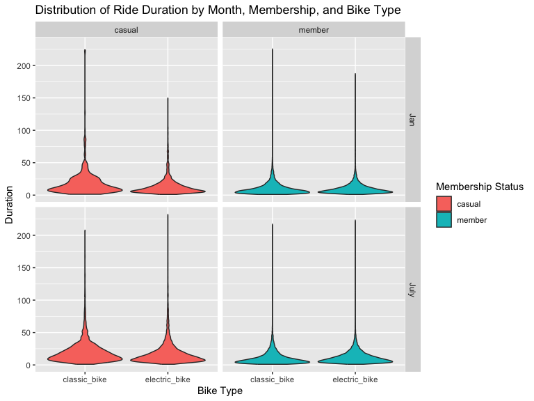

Homework 3
================
Kehan Su ks4186
2024-10-14

## Probelm 1

``` r
data("ny_noaa")
```

## Problem 2

## organizing data

exclude participants less than 21 years of age, and those with missing
demographic data; and encode data with reasonable variable classes
(i.e. not numeric, and using factors with the ordering of tables and
plots in mind).

``` r
demographic_df = read_csv("./data/nhanes_covar.csv", na = c("NA", ".", ""), skip = 4) |>
  janitor::clean_names() |>
  filter(age >= 21) |>
  filter(!is.na(bmi), !is.na(sex), !is.na(age), !is.na(education))
```

    ## Rows: 250 Columns: 5
    ## ── Column specification ────────────────────────────────────────────────────────
    ## Delimiter: ","
    ## dbl (5): SEQN, sex, age, BMI, education
    ## 
    ## ℹ Use `spec()` to retrieve the full column specification for this data.
    ## ℹ Specify the column types or set `show_col_types = FALSE` to quiet this message.

``` r
accelerometer_df = read_csv("./data/nhanes_accel.csv", na = c("NA", ".", "")) |>
  janitor::clean_names() |>
  pivot_longer(
    cols = starts_with("min"),
    names_to = "minute",
    values_to = "activity_value"
  )
```

    ## Rows: 250 Columns: 1441
    ## ── Column specification ────────────────────────────────────────────────────────
    ## Delimiter: ","
    ## dbl (1441): SEQN, min1, min2, min3, min4, min5, min6, min7, min8, min9, min1...
    ## 
    ## ℹ Use `spec()` to retrieve the full column specification for this data.
    ## ℹ Specify the column types or set `show_col_types = FALSE` to quiet this message.

merge the two data

``` r
final2_df =
  demographic_df |>
  inner_join(accelerometer_df, by = c("seqn")) |>
  mutate(
    sex = ifelse(sex==1,"male","female"),
    education = case_when(
      education == 1 ~ "less than high school",
      education == 2 ~ "high school equivalent",
      education == 3 ~ "more than high school"
    )
  )
head(final2_df)
```

    ## # A tibble: 6 × 7
    ##    seqn sex     age   bmi education              minute activity_value
    ##   <dbl> <chr> <dbl> <dbl> <chr>                  <chr>           <dbl>
    ## 1 62161 male     22  23.3 high school equivalent min1            1.11 
    ## 2 62161 male     22  23.3 high school equivalent min2            3.12 
    ## 3 62161 male     22  23.3 high school equivalent min3            1.47 
    ## 4 62161 male     22  23.3 high school equivalent min4            0.938
    ## 5 62161 male     22  23.3 high school equivalent min5            1.60 
    ## 6 62161 male     22  23.3 high school equivalent min6            0.145

## visualizing data

Produce a reader-friendly table for the number of men and women in each
education category

``` r
final2_df |>
  group_by(sex, education) |>
  mutate(
    sex = as.factor(sex),
    education = as.factor(education)
  ) |>
  summarise (count = n()) |>
  arrange (sex, education) |>
  knitr::kable()
```

    ## `summarise()` has grouped output by 'sex'. You can override using the `.groups`
    ## argument.

| sex    | education              | count |
|:-------|:-----------------------|------:|
| female | high school equivalent | 33120 |
| female | less than high school  | 40320 |
| female | more than high school  | 84960 |
| male   | high school equivalent | 50400 |
| male   | less than high school  | 38880 |
| male   | more than high school  | 80640 |

create a visualization of the age distributions for men and women in
each education category

``` r
age_distri_plot =
  final2_df |>
  ggplot(aes(x = age, fill = sex)) +
  geom_histogram(binwidth = 4) +
  facet_wrap(~education) +
  labs(title = "Age Distribution by Gender and Education",
       x = "Age",
       y = "Count")
print(age_distri_plot)
```



aggregate across minutes to create a total activity variable for each
participant. Plot these total activities (y-axis) against age (x-axis);
your plot should compare men to women and have separate panels for each
education level. Include a trend line or a smooth to illustrate
differences.

``` r
total_activity_df = 
  final2_df |>
  group_by(seqn, sex, age, education) |>
  summarize(total_activity = sum(`activity_value`, na.rm = TRUE))
```

    ## `summarise()` has grouped output by 'seqn', 'sex', 'age'. You can override
    ## using the `.groups` argument.

``` r
total_activity_df |>
  ggplot(aes(x = age, y = total_activity, color = sex)) +
  geom_point(alpha = .2) +
  geom_smooth (method = "loess", se = FALSE) +
  facet_wrap(~education) +
  labs(title = "Total Activity",
        x = "Age",
        y = "Total Activity",
        color = "Sex") +
  theme_minimal()
```

    ## `geom_smooth()` using formula = 'y ~ x'



Make a three-panel plot that shows the 24-hour activity time courses for
each education level and use color to indicate sex.

``` r
activity_time_df =
  final2_df |>
  group_by (sex, education, minute) |>
  summarize(average_activity = mean(`activity_value`, na.rm = TRUE))
```

    ## `summarise()` has grouped output by 'sex', 'education'. You can override using
    ## the `.groups` argument.

``` r
activity_time_df |>
  ggplot(aes(x = minute, y = average_activity, color = sex)) +
  geom_point(alpha = .2) +
  facet_wrap(~education) +
  labs(tittle = "24-hour Activity Time Courses for each Education Level and Sex",
       x = "Time (min)",
       y = "Average Activity Level",
       color = "Sex") +
  theme_minimal()
```



## Problem 3

import data

``` r
Jan2020_df =
  read_csv("./data/citibike/Jan 2020 Citi.csv", na = c("NA", ".", "")) |>
  janitor::clean_names() |>
  mutate(year = 2020, month = "Jan")
```

    ## Rows: 12420 Columns: 7
    ## ── Column specification ────────────────────────────────────────────────────────
    ## Delimiter: ","
    ## chr (6): ride_id, rideable_type, weekdays, start_station_name, end_station_n...
    ## dbl (1): duration
    ## 
    ## ℹ Use `spec()` to retrieve the full column specification for this data.
    ## ℹ Specify the column types or set `show_col_types = FALSE` to quiet this message.

``` r
Jan2024_df =
  read_csv("./data/citibike/Jan 2024 Citi.csv", na = c("NA", ".", "")) |>
  janitor::clean_names() |>
  mutate(year = 2024, month = "Jan")
```

    ## Rows: 18861 Columns: 7
    ## ── Column specification ────────────────────────────────────────────────────────
    ## Delimiter: ","
    ## chr (6): ride_id, rideable_type, weekdays, start_station_name, end_station_n...
    ## dbl (1): duration
    ## 
    ## ℹ Use `spec()` to retrieve the full column specification for this data.
    ## ℹ Specify the column types or set `show_col_types = FALSE` to quiet this message.

``` r
July2020_df =
  read_csv("./data/citibike/July 2020 Citi.csv", na = c("NA", ".", "")) |>
  janitor::clean_names() |>
  mutate(year = 2020, month = "July")
```

    ## Rows: 21048 Columns: 7
    ## ── Column specification ────────────────────────────────────────────────────────
    ## Delimiter: ","
    ## chr (6): ride_id, rideable_type, weekdays, start_station_name, end_station_n...
    ## dbl (1): duration
    ## 
    ## ℹ Use `spec()` to retrieve the full column specification for this data.
    ## ℹ Specify the column types or set `show_col_types = FALSE` to quiet this message.

``` r
July2024_df =
  read_csv("./data/citibike/July 2024 Citi.csv", na = c("NA", ".", "")) |>
  janitor::clean_names() |>
  mutate(year = 2024, month = "July")
```

    ## Rows: 47156 Columns: 7
    ## ── Column specification ────────────────────────────────────────────────────────
    ## Delimiter: ","
    ## chr (6): ride_id, rideable_type, weekdays, start_station_name, end_station_n...
    ## dbl (1): duration
    ## 
    ## ℹ Use `spec()` to retrieve the full column specification for this data.
    ## ℹ Specify the column types or set `show_col_types = FALSE` to quiet this message.

combine the data

``` r
citibike_df =
  bind_rows(Jan2020_df, Jan2024_df, July2020_df, July2024_df) |>
  filter (!is.na(start_station_name)) |>
  filter (!is.na(end_station_name)) |>
  mutate(weekdays = factor(weekdays, levels = c("Monday","Tuesday","Wednesday","Thursday","Friday","Saturday","Sunday"), ordered = TRUE)) |>
  arrange(weekdays)
```

Produce a reader-friendly table showing the total number of rides in
each combination of year and month separating casual riders and Citi
Bike members.

``` r
citibike_df |>
  group_by(year, month, member_casual) |>
  summarize(total_rides = n()) |>
  knitr::kable()
```

    ## `summarise()` has grouped output by 'year', 'month'. You can override using the
    ## `.groups` argument.

| year | month | member_casual | total_rides |
|-----:|:------|:--------------|------------:|
| 2020 | Jan   | casual        |         980 |
| 2020 | Jan   | member        |       11418 |
| 2020 | July  | casual        |        5625 |
| 2020 | July  | member        |       15388 |
| 2024 | Jan   | casual        |        2094 |
| 2024 | Jan   | member        |       16705 |
| 2024 | July  | casual        |       10843 |
| 2024 | July  | member        |       36200 |

Make a table showing the 5 most popular starting stations for July 2024;
include the number of rides originating from these stations.

``` r
popular_start_df =
  July2024_df |>
  group_by(start_station_name) |>
  summarize(total_rides = n()) |>
  arrange (desc(total_rides)) |>
  slice(1:5)
print(popular_start_df)
```

    ## # A tibble: 5 × 2
    ##   start_station_name       total_rides
    ##   <chr>                          <int>
    ## 1 Pier 61 at Chelsea Piers         163
    ## 2 University Pl & E 14 St          155
    ## 3 W 21 St & 6 Ave                  152
    ## 4 West St & Chambers St            150
    ## 5 W 31 St & 7 Ave                  146

Make a plot to investigate the effects of day of the week, month, and
year on median ride duration.

``` r
ride_duration_median =
  citibike_df |>
  group_by(year, month, weekdays) |>
  summarize(ride_duration_median = median(duration))
```

    ## `summarise()` has grouped output by 'year', 'month'. You can override using the
    ## `.groups` argument.

``` r
ggplot(ride_duration_median, aes(x = weekdays, y = ride_duration_median, fill = weekdays)) +
  geom_col(position = "dodge") +
  facet_grid(year~month) +
  labs(title = "Distribution of Median Ride Duration by Weekdays, Month, and Year",
       x = "Weekdays",
       y = "Median Duration")
```



For data in 2024, make a figure that shows the impact of month,
membership status, and bike type on the distribution of ride duration

``` r
ride2024_df = bind_rows(Jan2024_df, July2024_df)
```

``` r
  ggplot(ride2024_df, aes(x = rideable_type, y = duration, fill = member_casual)) +
  geom_violin(scale = "width") +
  facet_grid(month~member_casual) +
  labs(title = "Distribution of Ride Duration by Month, Membership, and Bike Type",
       x ="Bike Type",
       y = "Duration",
       fill = "Membership Status")
```


